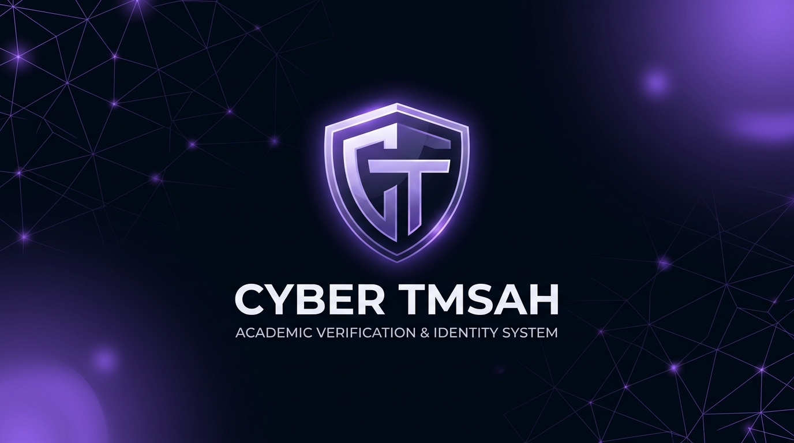

<div align="center">



# CYBER TMSAH

**من المحاضرة إلى المتابعة، تجربة أكاديمية واحدة.**

منصة عربية لتنظيم المحاضرات، تسجيل الحضور، ومتابعة الغياب، بصلاحيات مستقلة للطلاب وأعضاء هيئة التدريس والإدارة.

[زيارة المنصة](https://www.cyber-tmsah.site) · [دليل التشغيل](#التشغيل-محليًا) · [الإبلاغ عن مشكلة](https://github.com/zeyadmohamed2610/CYBER-TMSAH/issues)


</div>

---

<div dir="rtl">

## حالة التحضير للإطلاق — 10 أكتوبر 2026

أُجريت مراجعة للهيكلة والربط والصلاحيات والحضور والأداء على البيئة الحية باستخدام حسابات اختبار منفصلة. أُصلح خطأ تحميل حاضري المحاضرة، وأصبح GPS مطلوبًا للمحاضرات والسكاشن، مع نصف قطر يحدده المسؤول المخوّل بين 10 و500 متر.

نجح اختبار 1000 حساب مستقل عند 32 مستخدمًا نشطًا بالتوازي، مع 800 تسجيل حضور و200 رفض متوقع للرتب غير المسموح لها. هذا لا يُعد اعتمادًا لتحمل 1000 مستخدم متزامن: اختبار الضغط الأعلى رصد مهلات اتصال تحتاج اختبارًا موزعًا وتحديد مصدرها قبل إطلاق واسع. النتائج التفصيلية محفوظة محليًا لدى مالك المشروع.

## تجربة أكاديمية واضحة

صُممت **CYBER TMSAH** لتجمع إدارة المحاضرات والحضور في مكان واحد. يرى كل مستخدم الأدوات المناسبة لدوره، ويُتابع الطالب سجله، بينما يتابع المسؤول الطلاب والمواد الواقعة ضمن صلاحياته.

- **محاضرات منظمة:** إنشاء المحاضرات وإدارة فترات تسجيل الحضور.
- **متابعة دقيقة:** كشوف للحاضر والغائب والطلاب الذين ما زال التسجيل متاحًا لهم.
- **حسابات مستقلة:** خمس رتب، مع تقييد الوصول بحسب القسم والمواد المسندة.
- **تقارير قابلة للتصدير:** البحث والتصفية وتصدير الكشوف من الواجهات المخصصة.
- **واجهة عربية:** اتجاه من اليمين إلى اليسار، ودعم الشاشات الصغيرة والوضعين الداكن والفاتح.
- **ملف شخصي موحّد:** إدارة البيانات والصورة وكلمة المرور ووسائل تأكيد الهوية.
- **جدول قابل للضبط:** أسبوع يبدأ بالجمعة، إجازات قابلة للتغيير، وأماكن متبادلة بين الأسبوعين. يدعم استيراد ملف الجامعة الأصلي بالخلايا المدمجة والشيتات الأربع، مع معاينة قبل استبدال جدول الفرقة المحددة، وتصدير Excel.
- **استيراد آمن للجدول:** منع التعارض، ومعاينة قبل الحفظ، وحماية من استبدال نسخة تغيّرت أثناء مراجعتها.

## لكل دور مساحة عمل

### الطالب

تسجيل الحضور للمحاضرات والسكاشن المتاحة، متابعة النسب والسجل، وعرض جدول السكشن أو السكاشن الخمسة عشر وإدارة الحساب ومفتاح الحضور المعتمد.

### الدكتور والمعيد

الدكتور ينشئ المحاضرات، والمعيد ينشئ السكاشن للمواد المسندة إليهما. يدعم الحساب أكثر من مادة، وفتح التسجيل وإغلاقه ومراجعة الكشوف وتصحيح الحضور مع توثيق السبب.

### رئيس القسم

متابعة مستخدمي القسم ومواده ومحاضراته وسكاشنه، وإسناد المواد وإدارة الطلبات والجدول ومفاتيح الحضور داخل قسمه. إدارة بقية المنسقين تظل لمالك المنصة.

### مالك المنصة

إدارة المستخدمين والأقسام والمواد، ومتابعة المحاضرات والكشوف والسجلات على مستوى المنصة.

## كيف يُسجَّل الحضور؟

1. يفتح المسؤول المخوّل جلسة لمحاضرة أو سكشن، ويحدد فترة التسجيل ونصف قطر الحضور حول موقعه الحالي بين 10 و500 متر. يتطلب الفتح إذن الموقع.
2. تُحفظ قائمة الطلاب المستحقين بحسب القسم والفرقة والسكشن.
3. تظهر للطالب طريقتان فقط: **مفتاح المرور** لاختيار جلسة نشطة، و**رابط QR** لفتح الجلسة المحددة. يستطيع الطالب مسح QR بكاميرا الهاتف العادية؛ يفتح رابط المنصة ويعود إليه بعد تسجيل الدخول.
4. يؤكد الطالب مفتاح المرور المرتبط بحسابه، ثم يتحقق الخادم من الاعتماد والتحدي أحادي الاستخدام والنطاق الدراسي وGPS وصلاحية الجلسة قبل تسجيل الحضور. فتح الرابط وحده لا يسجل الحضور. لا يوجد إدخال يدوي لرمز حضور.
5. بعد انتهاء فترات التسجيل، تظهر حالات الغياب للطلاب المستحقين الذين لم يسجلوا.

الحضور يُحسب مرة واحدة لكل طالب في المحاضرة، حتى عند وجود أكثر من جلسة. الحالات التي ما زال تسجيلها مفتوحًا لا تدخل في نسبة الغياب. التصحيح اليدوي يحفظ السبب والمسؤول ووقت التعديل.

> يحتاج تأكيد الحضور الجديد إلى اتصال بالإنترنت. وسيلة تأكيد الهوية قد تكون البصمة أو الوجه أو رمز الجهاز، بحسب الجهاز والمتصفح.


## تحديث الحضور والأمان والتقارير — 9 أكتوبر 2026

- **خمس رتب فقط:** مالك المنصة، رئيس القسم، الدكتور، المعيد، الطالب. أُزيلت وظيفة تخصيص الصلاحيات الفردية وأيقونة الدرع وحقولها وإجراءاتها؛ الرتبة والقسم والمواد المسندة تحدد الوصول.
- **مفتاح حضور معتمد:** أول حضور موثَّق يربط مفتاح مرور مسجلًا بالحساب. إضافة مفتاح آخر أو حذف المفتاح القديم لا تتجاوز الربط. يستطيع المالك أو رئيس القسم المختص إلغاء الاعتماد عند تغيير الجهاز، مع إبطال المفتاح القديم وتوثيق العملية. كلمة المرور وحدها لا تؤكد حضور الطالب.
- **الوجه ورمز الجهاز:** يمكن تأكيد مفتاح المرور بالبصمة أو الوجه أو رمز قفل الجهاز بحسب دعم النظام والمتصفح. الموقع لا يحصل على بصمة أو صورة الوجه. مفاتيح المرور المتزامنة قد تعمل على أكثر من جهاز؛ اعتماد المفتاح ليس ضمانًا لمنع مزامنته ولا إثباتًا لهوية شخص بعينه.
- **QR كرابط:** يحمل رابط HTTPS رسميًا إلى الجلسة، دون كلمة مرور أو رمز مصادقة. يمكن مشاركته، لكن استعماله يظل مشروطًا بالحساب المستحق ومفتاحه المعتمد وموقعه داخل النطاق. رفض الرابط المنتهي أو الخارج عن نطاق الطالب لا يفتح مسار حضور بديلًا.
- **نوع الحصة:** المالك ورئيس القسم يختاران المحاضرة أو السكشن ورقمه عند فتح التسجيل. تغيير النوع أو السكشن ينشئ حصة مستقلة ويحفظ سجل الحصة الأصلية. الدكتور محاضرات والمعيد سكاشن في المواد المسندة. يمكن إعادة فتح فترة التسجيل للحصة في الفصل النشط؛ لا يتحول الطالب المسجل سابقًا إلى حضور مكرر.
- **تنظيف السجلات القديمة:** زر حذف الحصص المنتهية في القائمة، وزر حذف الجلسات المنتهية داخل تفاصيل الحصة، للمالك ورئيس القسم في نطاقهما. المعاينة تعرض العدد ثم يأتي التأكيد؛ حذفها يحذف سجلات الحضور المرتبطة أيضًا. صدّر الكشوف قبل الحذف. الجلسات النشطة وأرشيف الفصول المغلقة محميان.
- **PDF عربي جديد:** هوية بنفسجية واضحة، عناوين متكررة، صفوف لا تنقسم بين الصفحات، وترقيم صفحات. الحد 2000 سجل؛ للكشوف الأكبر استخدم Excel.
- **Excel حقيقي:** ملف XLSX بسيط بلا جدول مُنسق أو ألوان أو زخرفة، بعناوين الأعمدة والصفوف وتواريخ فعلية وأرقام هوية نصية لحفظ الأصفار. مناسب لعمل PivotTable داخل Excel. التصدير العام يجلب الصفحات بدل الاقتصار على أول 500 سجل، وحده الأقصى 50000 سجل برسالة صريحة عند تجاوزه.
- **تنقل الموبايل:** أربعة تبويبات أو أقل تظهر مباشرة أعلى مساحة العمل دون قائمة سفلية؛ الأدوار ذات التبويبات الأكثر تحتفظ بالقائمة السفلية و«المزيد».
- **كلمات المرور المسربة:** فحص خادمي عند طلب الانضمام وإنشاء الحساب وتغيير/استعادة كلمة المرور، باستعلام HIBP ذي بادئة تجزئة فقط، مع رفض كلمات المرور المسربة وإيقاف العملية إذا تعذر الفحص. مسارات كتابة كلمة المرور المباشرة محجوبة. حماية Supabase المدفوعة ليست مفعلة؛ الحماية هنا تنفيذ خاص يحتاج صيانة ومراجعة عند تغير Auth.
- **نسيت كلمة المرور:** الخادم يرسل الاستعادة فقط لحساب معتمد وغير محظور مرتبط بهوية Auth مؤكدة. الاستجابة موحدة حتى لا تكشف وجود البريد للآخرين.

### اختبار المالك قبل الإطلاق

1. سجّل مفتاح مرور بحساب طالب على هاتف فعلي، وجرّب البصمة أو الوجه أو رمز قفل الهاتف. افتح حصة بموقع ونطاق محددين، وسجّل من داخله ثم جرّب من خارجه وبدون إذن الموقع.
2. امسح QR بكاميرا هاتف خارج الموقع، ثم سجّل الدخول وتأكد من عودتك للجلسة نفسها وطلب تأكيد المفتاح. جرّب الرابط بعد إغلاق الجلسة وبحساب طالب غير مستحق.
3. أضف مفتاحًا ثانيًا: لا يُقبل للحضور بعد اعتماد الأول. ألغِ الاعتماد من الإدارة وجرّب المفتاح القديم، ثم اعتمد المفتاح الجديد. جرّب انتقالًا حقيقيًا بين جهازين، بما في ذلك المفاتيح المتزامنة.
4. افتح محاضرة وسكشن من حساب المالك، وراجع قوائم الطلاب ورقم السكشن. جرّب إعادة فتح فترة للحصة والتسجيل المكرر. جرّب تنظيف سجل منتهٍ مع إبقاء جلسة نشطة.
5. صدّر PDF متعدد الصفحات وXLSX، وراجع العربية والتواريخ والأصفار الأولى للأرقام. تأكد من عدم وجود القائمة السفلية بحساب الطالب وبقائها للمالك.
6. جرّب استعادة البريد المعتمد والبريد غير المعتمد ووصول الرسالة الفعلي، وتغيير كلمة مرور مسربة وكلمة مختلفة سليمة، وتحقق من تسجيل الخروج والجلسات القديمة.

التحقق الأخير شمل اختبارات الكود والبناء، والرتب على الكمبيوتر والموبايل، وعودة QR بعد تسجيل الدخول، وصيغ التصدير، وتزامن فتح الحصة مع تنظيف السجلات. ملفات الاختبارات والهجرات تظل محفوظة محليًا، وREADME منشور لتوثيق التشغيل.

فحص المكتبات ما زال يُظهر تنبيهًا واحدًا عالي الشدة في [braces](https://github.com/advisories/GHSA-vfj7-8cjw-p6xm)، دون إصدار رسمي مصحح وقت الفحص. تُطبَّق معالجة محلية لتقييد عمق الأنماط عبر patchedDependencies؛ استمرار تنبيه أداة التدقيق لا يعني أن المكتبة أصبحت نسخة رسمية مصححة. يلزم متابعة تحديثها ومراجعة المعالجة.

اختبارات المتصفح تستخدم محاكي WebAuthn وموقعًا تجريبيًا؛ لا تغني عن اختبار هاتف فعلي أو تثبت منع GPS المزيف. لم يُعتمد تحمل 1000 مستخدم متزامن حتى الآن. عدد الحسابات المختبرة ونجاح الاختبارات لا يعني ضمان خلو كل حالة ممكنة من الأخطاء.

## الهوية البصرية

<div align="center">
  
</div>

رمز **CT** موحّد، بنفسجي على كحلي، مع مساحات هادئة وتباين واضح. يُستخدم الرمز نفسه في الشعار وأيقونة المتصفح وأيقونات التطبيق وصورة المشاركة.


## التشغيل محليًا

المتطلبات: **Node.js 24** و**pnpm 12.5.1**، ومشروع Supabase مُعدّ بالجداول والإجراءات والوظائف التي تحتاجها المنصة.

```bash
git clone https://github.com/zeyadmohamed2610/CYBER-TMSAH.git
cd CYBER-TMSAH
pnpm install --frozen-lockfile
```

انسخ `.env.example` إلى `.env`، ثم اضبط:

```dotenv
VITE_SUPABASE_URL=https://your-project-ref.supabase.co
VITE_SUPABASE_ANON_KEY=your-public-anon-key
```

```bash
pnpm dev
```

افتح `http://localhost:8080`. ملف البيئة يربط الواجهة بالمشروع؛ إعداد قاعدة البيانات والوظائف خطوة منفصلة. الوظائف الموجودة في supabase/functions تُنشر إلى Supabase بصورة مستقلة عن Vercel.

**مفاتيح الإدارة تبقى على الخادم.** لا تُوضع في متغيرات `VITE_*`، ولا تُرفع ملفات البيئة أو بيانات حسابات الاختبار إلى المستودع.

## البناء والتحقق

```bash
pnpm lint
pnpm format:hosting
pnpm typecheck:hosting
pnpm build
pnpm preview
```

GitHub Actions يفحص التنسيق والأنواع وجودة الكود والبناء. النشر عبر تكامل Vercel مع GitHub، بينما وظائف Supabase تُنشر مستقلة.

بناءً على سياسة المستودع، الاختبارات والهجرات وأدوات التدقيق والتوثيق التفصيلي محفوظة في المشروع المحلي ومستبعدة من GitHub. الاختبارات الشاملة تُشغّل محليًا باستخدام pnpm check واختبارات المتصفح؛ النسخة المستنسخة من GitHub لا تتضمن هذه الأدوات ولا تاريخ إعادة إنشاء قاعدة البيانات. يجب الاحتفاظ بنسخة احتياطية منفصلة منها قبل نقل المشروع إلى جهاز آخر.

## داخل المشروع

```text
src/
├── app/              تجميع التطبيق والمسارات والإطار العام
├── features/
│   ├── auth/         الدخول والجلسات ومفاتيح الدخول
│   ├── accounts/     المستخدمون وطلبات الانضمام والبروفايل
│   ├── academics/    الأقسام والمواد
│   ├── schedule/     الجدول والامتحانات واستيراد Excel
│   ├── attendance/   الجلسات والحضور والغياب
│   ├── dashboards/   تجميع شاشات الرتب والإحصاءات
│   └── reports/      التقارير والتصدير
└── shared/           عناصر وأدوات وواجهات اتصال مشتركة
api/                  فحص الخدمة على الاستضافة
supabase/functions/   وظائف الخادم المنشورة إلى Supabase
public/               الهوية والصور وملفات التطبيق
scripts/seo-pages.ts  توليد صفحات النشر
```

التقارير المحلية وملفات التجارب ومخرجات البناء وبيانات الاختبار مستبعدة بواسطة `.gitignore`.

فحوص الهيكلة والاختبارات التفصيلية متاحة في النسخة المحلية فقط.

## أدوات التطوير

<div align="center">


</div>

## المساهمة والإبلاغ عن الأخطاء

افتح Issue يشرح الخطوات المؤدية للمشكلة والنتيجة المتوقعة والمتصفح المستخدم. احذف البيانات الشخصية من الصور والسجلات المرفقة. عند اقتراح تعديل، وضّح نطاقه وشغّل الفحوص المرتبطة به قبل فتح Pull Request.

لا تنشر مفاتيح سرية أو بيانات طلاب أو تفاصيل ثغرة قابلة للاستغلال في Issue عام؛ تواصل مع صاحب المشروع عبر [LinkedIn](https://www.linkedin.com/in/zeyadmohamed26/).

## صاحب المشروع

**زياد محمد — Zeyad Eltmsah**

[GitHub](https://github.com/zeyadmohamed2610) · [LinkedIn](https://www.linkedin.com/in/zeyadmohamed26/)

لا يتضمن المستودع حاليًا ترخيصًا مفتوح المصدر. إتاحة الكود للعرض لا تعني منح ترخيص لإعادة توزيعه أو استخدام الهوية البصرية.

</div>

---

<div align="center">

**CYBER TMSAH · سايبر تمساح**<br />
تنظيم أوضح. متابعة أدق. تجربة أكاديمية متكاملة.

</div>
